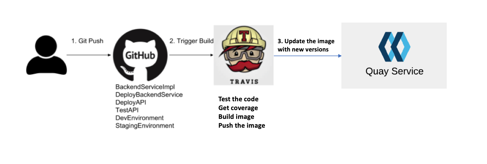

# Who should benefit with this repo
- **Using Github for open sourcing the project/application**
- **CI tools used for Build, test and push the image**
- **Pushing the image to a separate registry**
- **Require an automated versioning mechanism for tagging (tag of type 1.0.0) the image**
# What does this repo provides
- **Allows to commit git hub changes with a TAG in the commit message**
- **Based on the tag new version will be created for the image**
- **Version history will be pushed back to Git**

# AppVersioning

With cloud-native software in general and Kubernetes applications in particular, developers and operators face new challenges: How do I run my end-to-end tests in a Kubernetes environment? How can I automate the process of testing and releasing my application for different platforms and Kubernetes versions? How do I version my application for release. This repository will walk you through the versioning steps needed for your open source application which uses CICD framework.  

## Table of Contents

- [Introduction](#introduction)
- [CI Pipeline flow](#ci-pipeline)
- [How it Works](#how-it-works)

## Introduction

Git has its own versioning mechanism, which will be good for tracking commits to the branch. Open source applications are typically available through Git, which means there will not be any CD (Continues deployment) module. CD modules are used for deploying your application to the cloud and provide the latest and stable application to the customer. When customer wants to use such an open source application, they can pull the image/yaml provided in the github and deploy it in their enviornment. This model is called pull model, where there is no CD possible. When we create an open source application which provides support to its customers, requires a well-defined versioning mechanism to release, and support their applications.
 
 

## CI Pipeline

This is typical CI architecture. User commit a code to github, which will be pulled by CI tool and run the unit tests. If all the test cases are fine, it creates a new image and push that image to registry. Application requires a unique way of tagging each succesful image it pushes to git based on the kind of changes. This has to be automated.

## How it Works
- Version format is used Major.Minor.Patch. This format is called semantic versioning.
- Makefile and gitpush.sh script available under build folder. It is a good practice to keep build instruction under build folder.
- Require a version file in Git application repo. In this case, VERSION file used from version folder.  
- Makefile has different stages of CI which is being called from CI. In this case travis invokes each stage as mentioned in .travis.yaml
- CI test the code and then invoke publish stage. Which calls gitpush.sh script.
- Gitpush.sh uses three tags such as PATCH, MAJOR and MINOR.  
- When make the Git commit, based on the type of change, one of the TAG can be used.
- Travis env variable is using inside the script, which has to be set at travis. 

